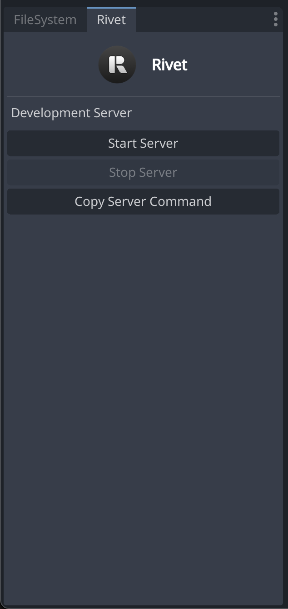

# Godot Plugin (Alpha)

_Godot 3 is not supported at the moment._

## Installation

### Method 1: Godot AssetLib

1. Open AssetLib
1. Search for "Rivet API"
1. Open _Project > Project Settings > Plugins_ and enable _Rivet API_
1. Open _Project > Project Settings > Autoload_ and ensure that `RivetClient` and `RivetHelper` are first on the list

### Method 2: Clone repository

1. Clone this repository
1. Open AssetLib
1. Click "Import..."
1. Select only the _addons_ folder and click _Install_
1. Navigate to the _plugin-godot_ repository and select _Open_
1. Open _Project > Project Settings > Plugins_ and enable _Rivet API_
1. Open _Project > Project Settings > Autoload_ and ensure that `RivetClient` and `RivetHelper` are first on the list

## Getting started

[Getting started guide](https://rivet.gg/learn/godot)

## Screenshots

## Contributing

### Setting up a local environment
1. Create a brand-new Godot project in `example-project`
2. Clone this repository to `plugin-godot` folder
3. Copy `project.godot` from `example-project` to `plugin-godot`
4. (Optional) Add `godot-plugin-refresher` to the addons folder
    - it's only available for Godot 3, but here's [a guide on how to make it work with Godot 4](https://www.reddit.com/r/godot/comments/11wedn6/comment/jcxm6op/)
5. Remove `example-project` folder
6. Voila, you can now start coding!

