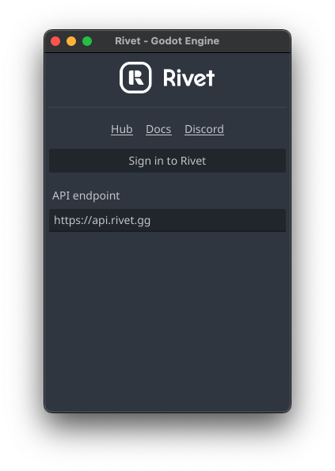
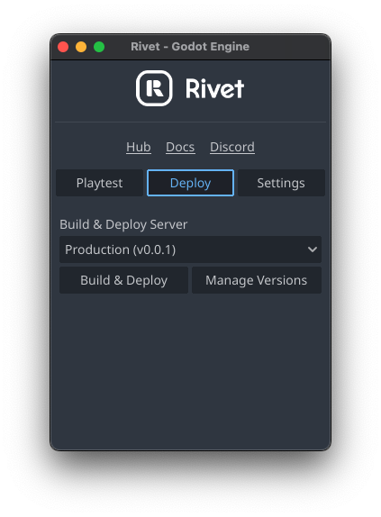

<p align="center">
	<picture>
		<source media="(prefers-color-scheme: dark)" srcset="./addons/rivet/images/icon-text-white.svg">
		
	</picture>
</p>
<h1 align="center">Rivet Godot Plugin</h1>
<p align="center">
	<a href="https://rivet.gg/discord"></a>
</p>

---

> [!WARNING]
> _Godot 3 is not supported at the moment._

## 📦 Installation

### Using [`gd-plug`](https://github.com/imjp94/gd-plug)

1. Add this line to your `plug.gd`:

```gdscript
plug("rivet/plugin-godot")
```

### Manual installation

1. [Download the latest
   release](https://github.com/rivet-gg/plugin-godot/releases/latest)
2. Unpack the `addons/rivet` folder into your `/addons` folder within the Godot
   project
3. Enable this addon within the Godot settings
   `Project > Project Settings > Plugins`

## 🚀 Getting started

Head over to our [Learning Center](https://rivet.gg/learn/godot) to get started
with Rivet and Godot.

## 🧐 Features

### Link your game with Rivet

One click and your game is connected! Linking your game with Rivet gives you
one-click deployments to production, easy developing setup, and ways to
configure your game's hosting and matchmaking.

### Deploy your game

Without the use of any command line commands, Rivet plugin lets you deploy your
game server in no time.

### Manage your tokens

Rivet lets you test your multiplayer games in multiple ways. Don't worry about
using any complicated commands, this plugin keeps you covered.

_and much more coming soon!_

## 📸 Screenshots

|<p align="center">Login screen</p>|<p align="center">Developing on your own machine</p>|
|---|---|

|<p align="center">Developing on Rivet Servers</p>|<p  align="center">Deploying your game</p>|
|---|---|

## 🏗️ Contributing

1. Look for any issue that describes something that needs to be done - or, if
   you're willing to add a new feature, create a new issue with an appropriate
   description.
2. Submit your pull request.
3. Rivet team will review your changes.
4. Don't forget to join [Rivet's Discord](https://rivet.gg/discord) to hang out
   with the devs, or to pairprogram together!

## Examples

Each folder in the `examples/` folder is its own independent Godot project.

### Enabling support for symbolic links on windows

This repository relies on use of symbolic links in order to re-use the `addons/rivet/` folder inside of `examples/*/addons/rivet/`.

If you don't files in the folder `examples/*/addons/rivet/`, do the following:

**Enable developer mode**

1. Open _Settings_
2. Navigate to _Updates & Security > For Developers_
3. Enable _Developer Mode_

    

**Enable symlinks in Git**

1. Delete the `plugin-godot` folder
2. Download and run the Git installer (even if Git is already installed)
3. Uncheck _Only show new options_ at the bottom of the window
4. Click _Next_ until you see the _Configuring extra options_ screen
5. Check _Enable symbolic links_
6. Finish the installation
7. Re-clone the repository. You should see files under `examples/*/addons/rivet/`.

    

